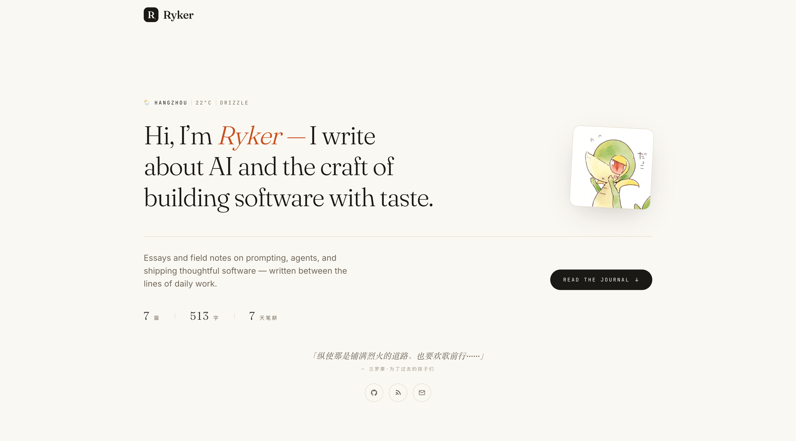
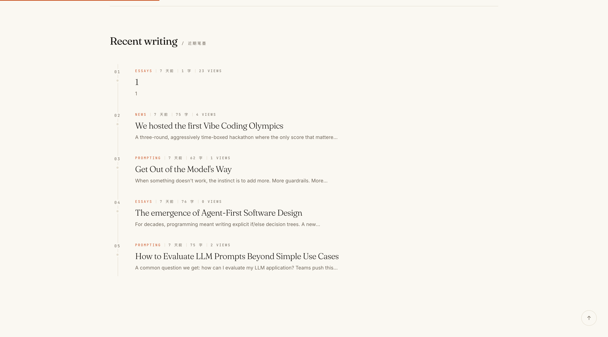
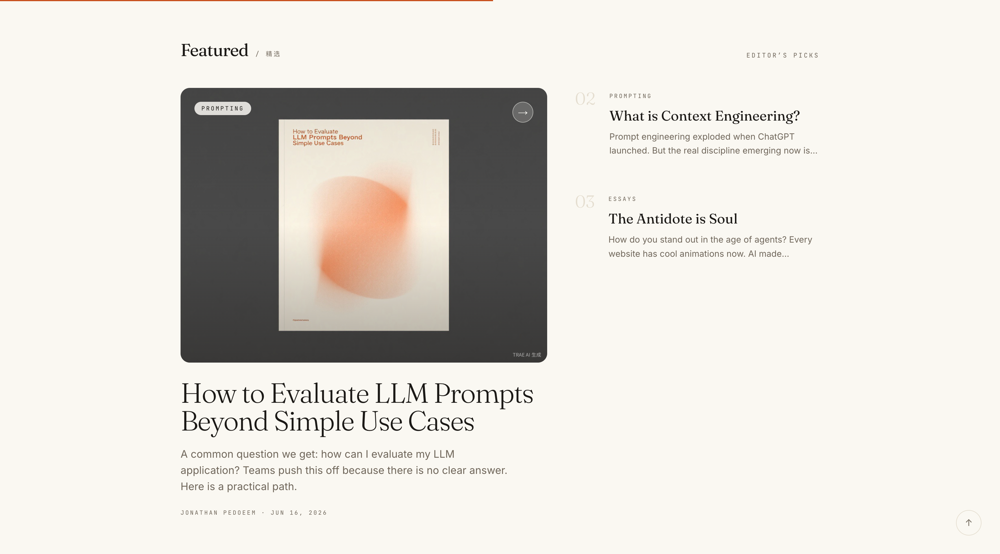
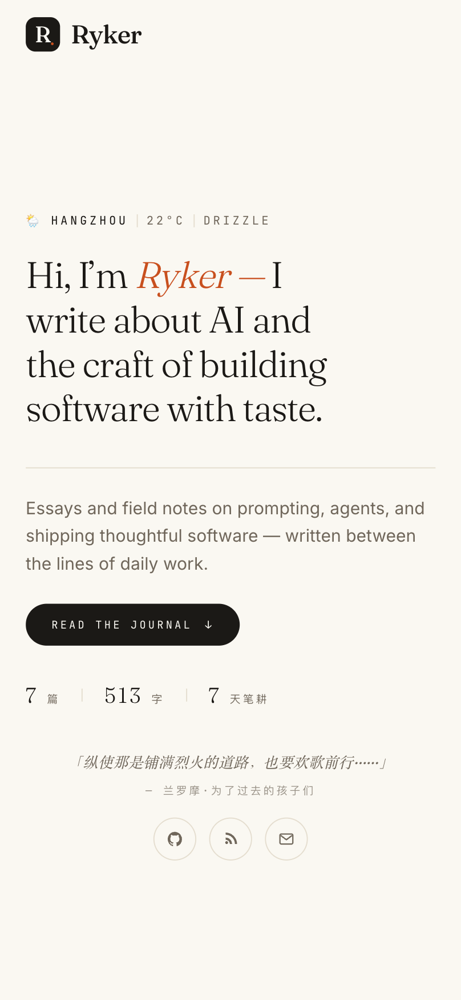

<h1 align="center">Ryker Editorial Blog</h1>

<p align="center">
  <strong>An editorial personal blog for AI engineering, prompting, agents, and thoughtful software craft.</strong>
</p>

<p align="center">
  English · <a href="./README.zh-CN.md">简体中文</a>
</p>

<p align="center">
  
  
  
  
</p>

An editorial personal blog for writing about AI engineering, prompting, agents, and the craft of building thoughtful software. It includes a polished public reading experience and a private authoring admin inside the same Next.js application.

## Preview

<table>
  <tr>
    <td width="50%">
      <strong>Desktop · Hero</strong><br>
      
    </td>
    <td width="50%">
      <strong>Desktop · Recent Writing</strong><br>
      
    </td>
  </tr>
  <tr>
    <td width="50%">
      <strong>Desktop · Featured</strong><br>
      
    </td>
    <td width="50%">
      <strong>Mobile · Hero</strong><br>
      
    </td>
  </tr>
</table>

## Features

- Editorial homepage with hero, recent writing, featured posts, and archive filters.
- Responsive reading experience for desktop and mobile.
- Markdown post rendering with Chinese font fallbacks.
- Private admin for creating, editing, publishing, unpublishing, and deleting posts.
- Password-based admin session with HTTP-only cookies.
- Admin routes are not linked from public navigation and are marked `noindex, nofollow, noarchive`.
- SQLite + Prisma persistence for a simple personal publishing workflow.
- Dockerfile and docker-compose for deployment experiments.

## Tech Stack

- Next.js 14 App Router
- React 18
- TypeScript
- Tailwind CSS
- Prisma
- SQLite
- react-markdown + remark-gfm

## Getting Started

Install dependencies:

```bash
npm install
```

Create a local `.env` file:

```env
DATABASE_URL="file:./dev.db"
ADMIN_PASSWORD="change-me"
AUTH_SECRET="replace-with-a-long-random-string"
```

Initialize the database:

```bash
npm run db:push
npm run db:seed
```

Start the development server:

```bash
npm run dev
```

Open:

- Public site: `http://localhost:3000`
- Admin login: `http://localhost:3000/admin/login`

## Scripts

```bash
npm run dev       # Start local development server
npm run build     # Generate Prisma client and build Next.js
npm run start     # Start production server
npm run lint      # Run Next.js lint
npm run db:push   # Push Prisma schema to SQLite
npm run db:seed   # Seed demo content
```

## Admin Privacy

The admin is intentionally kept in the same application for a simple personal publishing workflow. It is not linked from the public navigation, all write APIs require an authenticated session, and admin responses include:

```http
X-Robots-Tag: noindex, nofollow, noarchive
```

For a personal blog, the default password gate is usually enough. If the site is deployed publicly and receives unwanted scans, add a secret admin path or IP allowlist at the middleware layer.

## Project Structure

```text
app/                  Next.js routes and API handlers
components/           UI components
lib/                  Auth, database, and formatting helpers
prisma/               Prisma schema and seed data
public/               Static assets and screenshots
tests/                Lightweight behavior tests
```

## Deployment Notes

- Set `DATABASE_URL`, `ADMIN_PASSWORD`, and `AUTH_SECRET` in the deployment environment.
- Use a long random `AUTH_SECRET` in production.
- Do not commit local `.env` files or SQLite database files.
- If you deploy with `next/font`, production builds need access to Google Fonts unless fonts are self-hosted.

## License

Private personal project. Add a license before distributing or accepting external contributions.
