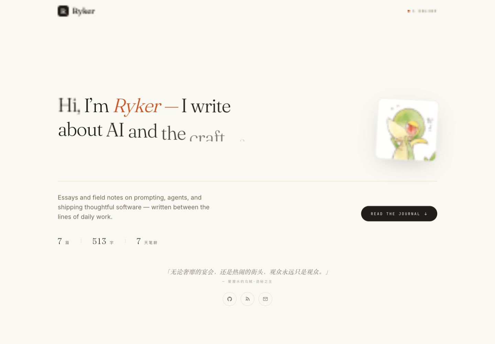
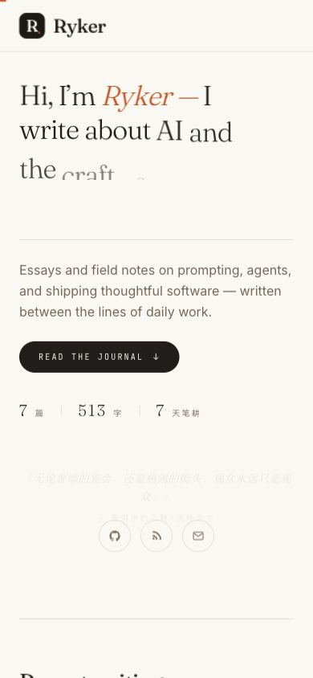

# Ryker Editorial Blog

[English](./README.md) | 简体中文

一个用于记录 AI 工程、提示词、Agent 和软件构建手艺的个人编辑型博客。项目包含面向读者的前台阅读体验，也把私有写作后台保留在同一个 Next.js 应用里。

## 预览

### 桌面端



### 移动端



## 功能

- 编辑型首页：首屏介绍、近期文章、精选文章和归档筛选。
- 桌面端与移动端的响应式阅读体验。
- Markdown 文章渲染，并补充中文字体 fallback。
- 私有后台：创建、编辑、发布、取消发布和删除文章。
- 基于密码的后台登录，会话使用 HTTP-only cookie。
- 后台入口不出现在公开导航中，并标记为 `noindex, nofollow, noarchive`。
- 使用 SQLite + Prisma，适合个人博客和轻量发布流程。
- 包含 Dockerfile 和 docker-compose，便于做部署实验。

## 技术栈

- Next.js 14 App Router
- React 18
- TypeScript
- Tailwind CSS
- Prisma
- SQLite
- react-markdown + remark-gfm

## 本地启动

安装依赖：

```bash
npm install
```

创建本地 `.env` 文件：

```env
DATABASE_URL="file:./dev.db"
ADMIN_PASSWORD="change-me"
AUTH_SECRET="replace-with-a-long-random-string"
```

初始化数据库：

```bash
npm run db:push
npm run db:seed
```

启动开发服务：

```bash
npm run dev
```

打开：

- 前台：`http://localhost:3000`
- 后台登录：`http://localhost:3000/admin/login`

## 脚本

```bash
npm run dev       # 启动开发服务
npm run build     # 生成 Prisma Client 并构建 Next.js
npm run start     # 启动生产服务
npm run lint      # 运行 Next.js lint
npm run db:push   # 同步 Prisma schema 到 SQLite
npm run db:seed   # 写入示例内容
```

## 后台私有化

后台保留在同一个应用中，方便个人发布文章。前台导航不会暴露后台入口，所有写入 API 都要求登录态，并且后台响应会附带：

```http
X-Robots-Tag: noindex, nofollow, noarchive
```

对于个人博客，默认密码门禁通常足够。如果公开部署后遇到扫描，可以继续在 middleware 层增加隐藏后台路径或 IP 白名单。

## 项目结构

```text
app/                  Next.js 页面与 API 路由
components/           UI 组件
lib/                  认证、数据库和格式化工具
prisma/               Prisma 模型与种子数据
public/               静态资源与截图
tests/                轻量行为测试
```

## 部署说明

- 在部署环境中配置 `DATABASE_URL`、`ADMIN_PASSWORD` 和 `AUTH_SECRET`。
- 生产环境请使用足够长的随机 `AUTH_SECRET`。
- 不要提交本地 `.env` 文件或 SQLite 数据库文件。
- 如果继续使用 `next/font`，生产构建需要能访问 Google Fonts；否则需要改为自托管字体。

## 许可证

个人项目。若要公开分发或接受外部贡献，请先补充许可证。
